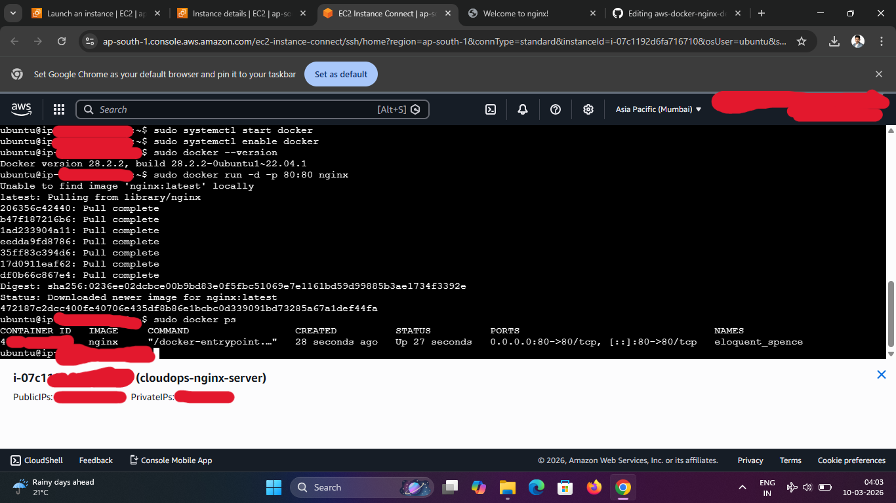
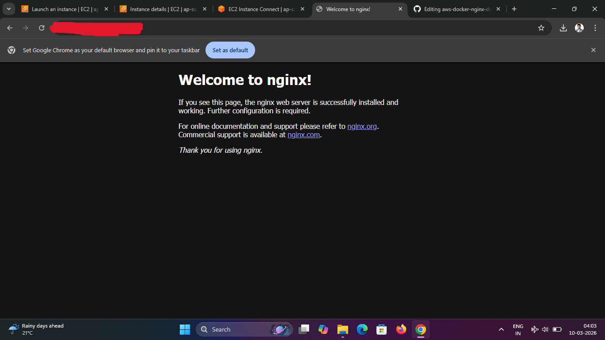

# AWS Docker Nginx Deployment
## Project Overview
This Project demonstrate deploying a containerized Nginx web server on AWS EC2 using Docker
## Technologies used
- AWS EC2
- Ubuntu Linux
- Docker
- Nginx
- Github
---
## Architecture
User Browser → AWS EC2 Instance → Ubuntu Server → Docker Engine → Nginx Container → Web Server on Port 80
---
## Steps Performed
### 1. Launch EC2 Instance
- Created Ubuntu EC2 instance in AWS
- Enabled HTTP and SSH access in Security group
### 2. Connect to server
- Connected to EC2 using SSH
```
ssh -i <key.pem> ubuntu@<public-IP>
```
### 3. Install Docker
```
sudo apt update
sudo apt install docker.io -y
```
### 4. Start Docker Service
```
sudo systemctl start docker
sudo systemctl enable docker
```
### 5. RUN Nginx image
```
sudo docker run -d -p 80:80 nginx
```
### 6. Verify Running Container
```
sudo docker ps
```
---
## Accessing the web server
After deploying the container, the Nginx web server becomes accessible through the EC2 public IP.
Example:
http://<EC2-public-IP>
This loads the Nginx default welcome page in the browser.
## Deployment Screenshots
### EC2 Instance Running

### Docker Container Running

### Nginx Web Server

---
## Key Learnings
- Launching and configuring AWS EC2 instance
- Installing and managing Docker containers
- Running containerized applications
- Exposing services via public ports
- Documenting infrastructure projects on GitHub
---
## Future Improvements
- Add Dockerfile for custom website
- Automate deployment using CI/CD pipelines
- Deploy using Infrastructure as Code (Terraform)
---
## Author
Bijendra Kumar Deori

Aspiring CloudOps/DevOps Engineer
